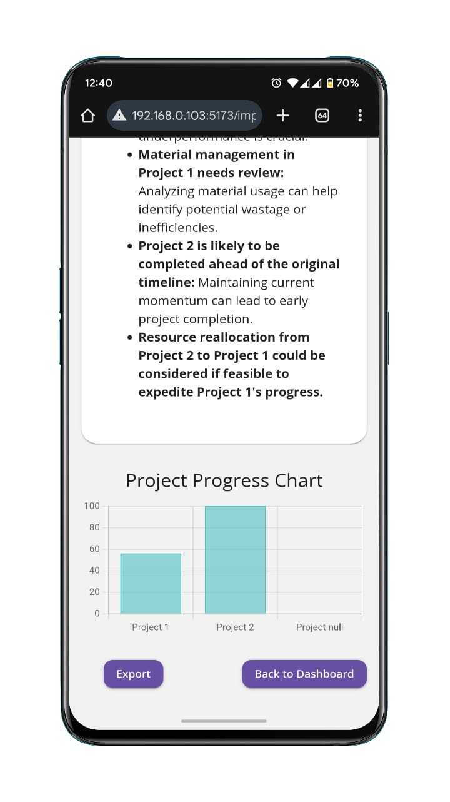

<h1 align="center"> Track 3D AI - Construction Analytics Platform </h1>

<div align="center">

AI-powered construction project analytics and forecasting platform.

</div>

## Features

- AI-Powered Analytics: Predict project completion dates, resource needs, and deviations.

- Real-Time Progress Tracking: Compare planned vs. actual progress.
 
- Role-Based Access Control:
 
   - Core User: Access analytics and reports.
 
   - Admin User: Full project management control.
 
- Dashboards & Reports: Generate reports with real-time data insights.

## Chart


## Installation

### Prerequisites

   - Python 3.11+

   - FastAPI & TypeScript
   
   - Docker

   - Amazon S3 Bucket
 
## Setup

### Clone the repository
```shell
git clone https://github.com/MisfiT2020/Track-3D.git
cd Track-3D
```

### Install backend dependencies
```cd backend
pip install -r requirements.txt
```

### Install frontend dependencies
```
cd frontend
npm install
```

## Configuration

- Update the address in vite.config.ts as needed.

### Branches / Builds

This project supports **two types of database builds**, each maintained under separate branches:

- **Main Branch (`main`)** – Uses a **serverless/hosted database** (e.g., Supabase, PlanetScale) for production-ready, scalable deployment.
- **Static DB Branch (`static-db`)** – Uses a **local SQLite DB** for quick setup, development, and offline demos.

> Switch to the branch that suits your use case:
```bash
git checkout main        # For hosted serverless DB  
git checkout static-db   # For local static SQLite DB
```

## Run the Application

### Start the application using Docker
```
sudo docker compose up --build
```

## Screenshots

### ADMIN INTERFACE
|                       |                       |
| --------------------- | --------------------- |
|  |  |
|  |  |
|  |  |
|  |  |
|  |  |
|  |  |
| |


### USER INTERFACE
|  |  |
| ---------------------- | ---------------------- |
|  |                       |


## Usage

- Log in to access your projects.

- Upload project plans and monitor progress.

- View AI-generated insights and analytics.

- Generate and export reports.


## Default Credentials (Admin Demo Account)

```body
Username: misfit  
Password: misfit
```
> Normally, when signing-up from site, requires normal password requirements. > but it's a demo. so, makin it easier to login.


## Permissions
 
### CLI Method 

- To update a account as sudo, we need to need make the sudo account from **swagger ui**

### SWAGGER Method

- To update from swagger ui, go to running backend port `<url>:<port>/docs#/`
- select `sign-up` field
```body
{
  "username": "misfit",
  "email": "misfit",
  "password": "misfit",
  "is_sudo": true
}
```
🔹 change the `is_sudo` to change the admin permission for the user when creating 